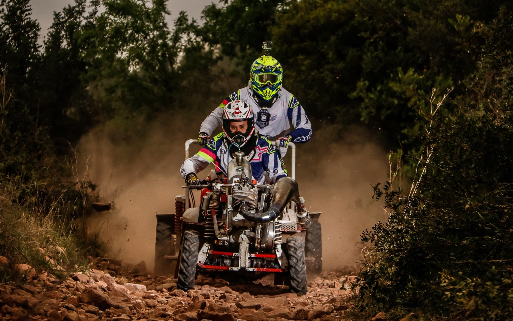
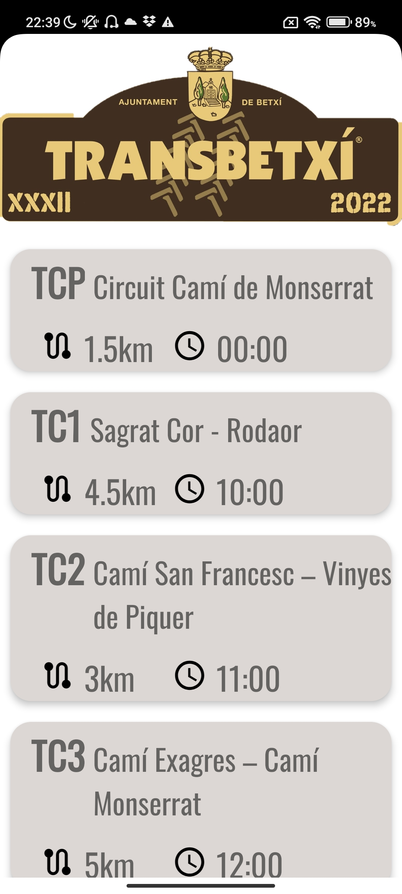
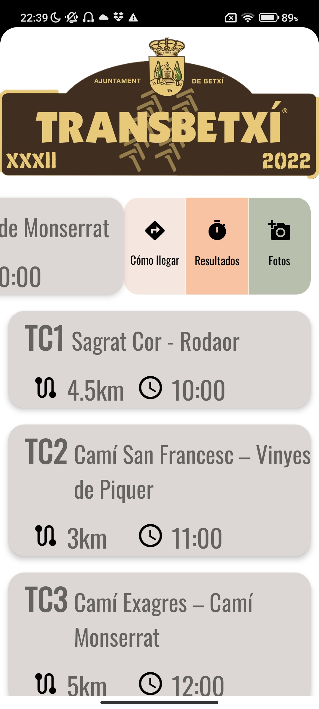
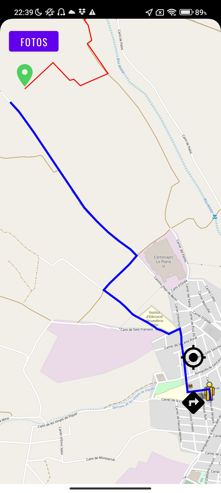

# Rally Transbetxí 🏁

## About
Just like every year since 1988, the [Rally Transbetxí](https://www.transbetxi.com/) returns to Betxí, Castellón (Spain), featuring a **unique motorsport event** – the motocultor rally. A motocultor is a small agricultural machine with no more than 10 horsepower. While its power might not be impressive, things change when we swap the original engine for a modified 250cc Bultaco engine, producing around 40 horsepower and reaching speeds of up to 100 kilometers per hour. Quite a transformation, right? 🏎️💨

With the increased power comes the need for improved brakes, suspensions, and tires. Even so, motocultores remain somewhat unstable, leading to the formation of two-member teams: a rider and a co-pilot who acts as a counterbalance during turns, much like a sidecar passenger.

 
Photo credits: [Alejandro Tinieblas](https://www.alejandromilart.com/motorets-transbetxi-2018/)

This well-established competition revolves around this concept, and this year it introduces an exciting addition: an Android application that allows spectators to follow live timing results and get real-time updates on the race progress. Now you can stay connected with all the action happening on the track, witnessing the motocultores incredible speed and skill firsthand 

📢 Join us as we celebrate the legacy of the **Rally Transbetxí**.

📆 **Friday, April 5 2024**, until **Saturday, April 6 2024**. 

📍 **Betxí, Castellón (Spain)**

🌐 [https://www.transbetxi.com/](https://www.transbetxi.com/)

## Current App State
Under construction 🚧 
The project is currently undergoing redevelopment, with plans to utilize Kotlin, Jetpack Compose, and best practices for future enhancements and improvements.

## Screenshots
|  |   |
|:------------------------------------:|:-----------------------------:|
| Home Screen                           |   Map Screen                |

|  |  |
|:------------------------------------:|:-----------------------------:|
|            Home Screen with an item dragged                 | Map Screen displaying a route                 |
